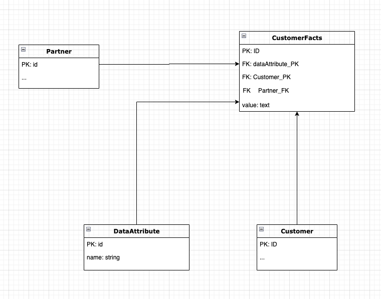

# rails-concern

Database

Minimal Example

For the code challenge we require to have some sort of facts table in order to store this attribute exceptions.

The table DataAttributes contains a primary key and a name for each attribute. This table can be used for any other model that will require the same attribute.

The table Partner will be each partner.
The table Customer contains all the non custom attributes.

For the customer case the CustomerFacts will contain a primary key and 2 foreign keys ( customer and the partner for the sql query) and one foreign key to get the attribute that we want to pick. The value column will tell us what is the string value of that attribute.

For other models we need to add other tables such as the customerfacts in order to have custom attributes per model.

---

For the ruby logic.

As for the ruby code I created a concern where it includes a set of attribute into each of the model and a function to check if the values of each attribute are present/not blank.

the concern was included in the model.
